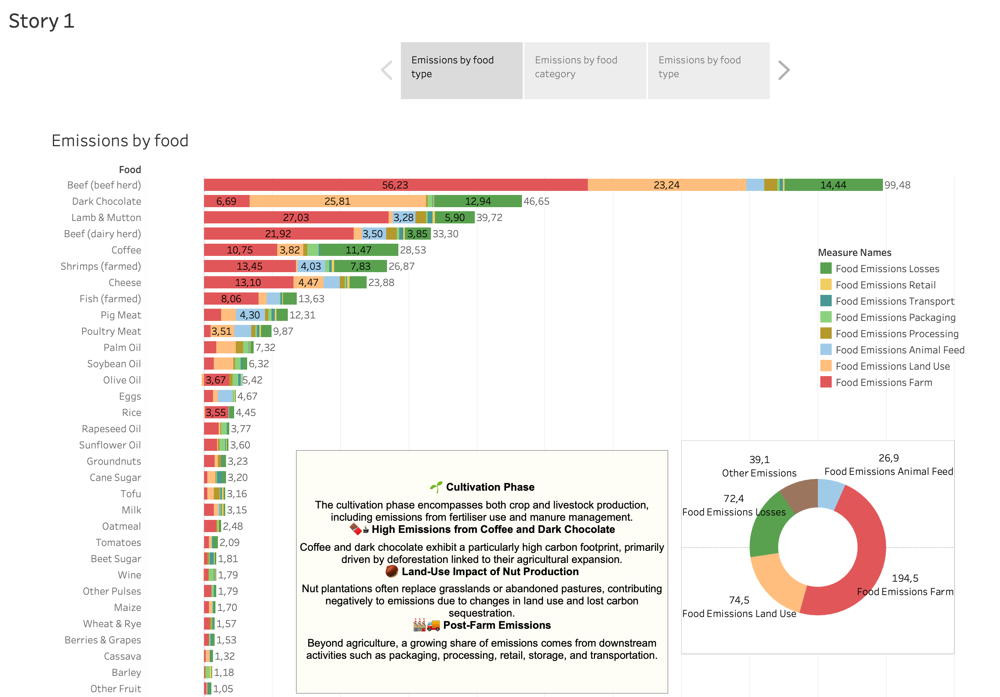
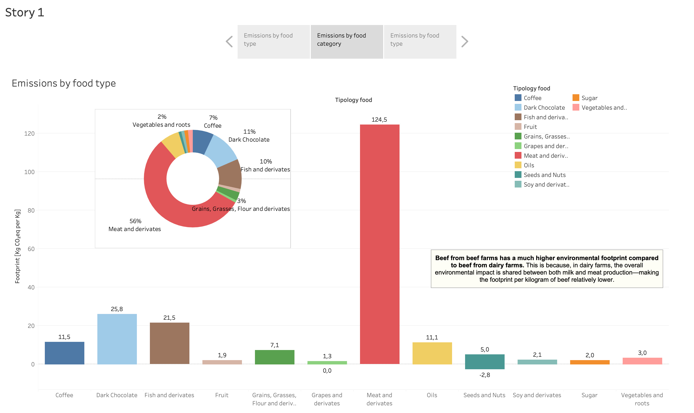
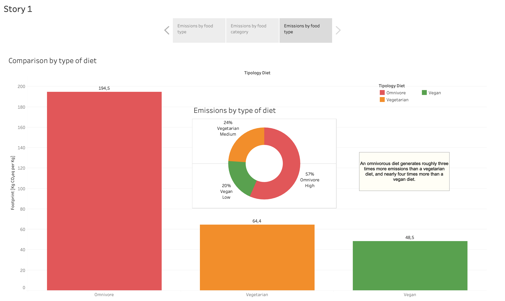

# Sustainable Menu Design: Food Carbon Emissions Analysis

## Executive Summary

Restaurants are increasingly looking to reduce their environmental impact while meeting growing consumer demand for sustainable food options. To support menu planning decisions, I analyzed greenhouse gas emissions across 29 food products and 8 supply chain stages using **Tableau**.

The objective was to identify which foods contribute most to carbon emissions and compare the environmental impact of omnivorous, vegetarian, and vegan diets. Through interactive dashboards and visual storytelling, the analysis highlights the foods and production stages responsible for the largest share of emissions and provides actionable insights for building lower-carbon menus.

The results show that animal-based products, particularly beef, are responsible for a disproportionate share of food-related emissions, while plant-based diets offer the greatest opportunity for reducing environmental impact.

### Key Business Impact

* Analyzed carbon emissions across 29 food products and 8 lifecycle stages
* Identified the highest-emission ingredients for menu optimization
* Compared the environmental impact of vegan, vegetarian, and omnivorous diets
* Developed interactive Tableau dashboards for non-technical stakeholders
* Generated recommendations for reducing menu-related carbon footprints

---

## Business Problem

Restaurants and food service businesses are under increasing pressure to improve sustainability while maintaining customer satisfaction and profitability.

However, decision-makers often lack visibility into:

* Which menu ingredients generate the highest carbon emissions
* Which stages of the supply chain contribute most to environmental impact
* How different dietary patterns compare from a sustainability perspective
* Which menu changes could significantly reduce emissions without limiting customer choice

The goal of this project was to create a data-driven framework that helps restaurants evaluate ingredient sustainability and design menus with lower environmental impact.

---

## Methodology

### Data Preparation

* Analyzed greenhouse gas emissions data for 29 food products
* Examined emissions across 8 lifecycle stages:

  * Farm
  * Land Use
  * Animal Feed
  * Processing
  * Packaging
  * Transport
  * Retail
  * Losses

### Dashboard Development

Built interactive Tableau dashboards to analyze:

* Emissions by food item
* Emissions by food category
* Emissions by supply chain stage
* Diet comparisons (omnivore, vegetarian, vegan)

### Visualization & Storytelling

Used Tableau features including:

* Interactive dashboards
* Filters
* Tooltips
* Comparative visualizations
* Category breakdowns

to communicate insights clearly to non-technical audiences.

---

## Skills

**Tableau:** Dashboard Design, Interactive Filtering, Data Visualization, Storytelling with Data, KPI Development

**Data Analysis:** Sustainability Analysis, Environmental Impact Assessment, Comparative Analysis, Category Analysis, Decision Support Analytics

**Business Intelligence:** Dashboard Development, Stakeholder Reporting, Insight Communication, Data-Driven Decision Making

---

## Results & Business Recommendations

The analysis revealed several important insights regarding food-related carbon emissions.

### Food Emissions

* Beef is the most carbon-intensive food product, generating 99.48 kg CO₂eq per kilogram produced.
* Beef emissions are more than double those of lamb and significantly higher than most plant-based foods.
* Meat and animal-derived products account for 56% of total emissions across food categories.

### Supply Chain Impact

* Farm-level production is the largest contributor to food emissions.
* Land use and food losses are the second and third largest emission sources.
* Transportation contributes less than many consumers expect, suggesting that food type matters more than food miles.

### Diet Comparison

* An omnivorous diet generates approximately 194.5 kg CO₂eq.
* A vegetarian diet reduces emissions by roughly two-thirds.
* A vegan diet produces the lowest emissions, generating approximately one-quarter of the emissions associated with an omnivorous diet.

### Business Recommendations

Based on the findings, I would recommend:

* Reducing the number of high-emission ingredients, particularly beef-based menu items.
* Expanding plant-based and vegetarian offerings to lower overall menu emissions.
* Highlighting low-carbon dishes within menus to support environmentally conscious purchasing decisions.
* Reducing food waste through inventory optimization and portion management.
* Using carbon footprint information as part of restaurant sustainability initiatives and customer communication strategies.
* Creating sustainability-focused menu categories to encourage lower-impact food choices.

These actions would allow restaurants to significantly reduce their environmental footprint while responding to increasing consumer interest in sustainable dining options.

---

## Next Steps

* Build an interactive sustainability score for each menu item.
* Incorporate nutritional metrics alongside environmental impact measures.
* Create scenario models to estimate emission reductions under different menu configurations.

---

## Tableau Dashboards

### Emissions by Food Item

### Emissions by Food Category

### Diet Comparison — Omnivore vs Vegetarian vs Vegan

> 🎥 Prefer the interactive version? Watch the full [Dashboard Demo Video](https://drive.google.com/file/d/1iFHuzY4vjlpdJUunWS_MM6m_xrY2NXhl/view?usp=share_link)

---

## Dataset  
- **Source:** [Global Food Emissions by Lifecycle Stage](https://ourworldindata.org/grapher/food-emissions-production-supply-chain)  
- **Study:** [Joseph Poore & Thomas Nemecek (Science, 2018)](https://ourworldindata.org/food-choice-vs-eating-local)
 
---

## Files in this Repository  
| File | Description |
|------|--------------|
| `Food_Emissions_Presentation.pdf` | Summary of key insights, strategy suggestions, and dashboard link. |
| `DASHBOARDS` | Screenshots: emissions by food item, emissions by food category, diet comparison (omnivore, vegetarian, vegan).  |
| `README.md` | Project overview, dataset details, insights, and links. |
